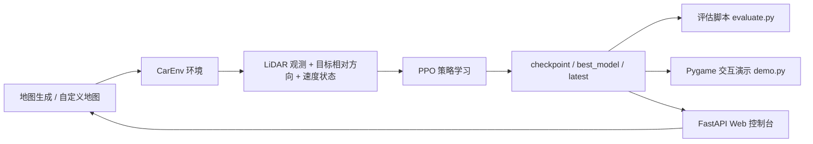

# Reinforcement Learning Based Robot Obstacle Avoidance

<div align="center">


</div>

<p align="center">
一个围绕 <strong>二维移动机器人/小车避障</strong> 搭建的强化学习实验项目：从地图生成、LiDAR 感知、PPO 训练，到评估、可视化演示与 Web 控制台，形成完整闭环。
</p>

---

## 项目概览

这个仓库的目标不是只“跑通一个模型”，而是搭建一个适合实验、展示和迭代的避障研究工作台。项目将机器人导航问题抽象为二维栅格环境中的连续控制任务：智能体需要依赖 LiDAR 风格的距离观测、目标相对方向和自身速度状态，在障碍密集地图中自主规划运动，尽可能稳定地到达终点并避免碰撞。

从工程视角看，它具备三个层面的价值：

1. **研究层**：可以快速验证 PPO 在局部感知避障任务上的学习效果。
2. **系统层**：训练、评估、地图管理、实时演示、Web 面板全部打通，适合做课程项目、竞赛原型和展示型仓库。
3. **扩展层**：环境、奖励函数、传感器建模和策略网络都相对独立，便于后续替换为更复杂的导航任务或多传感器方案。

## 项目全景



这个流程意味着仓库并不是单文件实验，而是一个完整的“训练到展示”流水线。你既可以把它当作强化学习环境来训练，也可以把它当成可交互的演示系统来展示模型表现。

## 核心能力

| 模块 | 作用 | 当前实现 |
| --- | --- | --- |
| 环境建模 | 定义机器人状态转移、动作空间与终止条件 | `env/car_env.py` |
| 障碍地图 | 随机生成可达地图，或读取固定地图 | `env/map_generator.py` + `maps/*.json` |
| 传感器模拟 | 使用多射线 LiDAR 扫描局部障碍距离 | `env/lidar_sensor.py` |
| 强化学习训练 | 基于 Stable-Baselines3 的 PPO 训练流程 | `training/train.py` |
| GPU 训练 | 面向服务器的大规模并行训练入口 | `train_gpu_server.py` |
| 评估分析 | 统计成功率、碰撞率、平均步数、平均路径长度 | `evaluation/evaluate.py` |
| 可视化演示 | 实时查看模型在地图中的避障轨迹 | `demo.py` |
| Web 控制台 | 启动训练、查看日志、管理模型、编辑地图 | `web/app.py` |

## 环境设计

### 1. 状态空间

智能体观测由两部分组成：

- `LiDAR` 距离归一化结果
- 与目标相关的方向信息和运动信息

在当前实现中，观测向量长度为 `lidar_rays + 4`，其中额外 4 个量分别表示：

| 组成 | 含义 |
| --- | --- |
| `sin(goal_angle)` | 目标相对朝向的正弦值 |
| `cos(goal_angle)` | 目标相对朝向的余弦值 |
| `linear_vel / MAX_LINEAR_VEL` | 线速度归一化 |
| `angular_vel / MAX_ANGULAR_VEL` | 角速度归一化 |

这种设计的好处是，策略不仅知道“前方有没有障碍”，还知道“目标在什么方向”和“当前自己运动得有多快”，因此更适合学习趋近目标与避障之间的平衡。

### 2. 动作空间

动作是二维连续控制：

| 动作维度 | 范围 | 含义 |
| --- | --- | --- |
| `action[0]` | `[-1, 1]` | 控制线速度 |
| `action[1]` | `[-1, 1]` | 控制角速度 |

环境内部会将动作映射到真实线速度和角速度，再更新机器人朝向和位置。这意味着它不是离散的“上/下/左/右”走格子，而是更接近简化版移动机器人控制。

### 3. 奖励函数

当前奖励设计强调“向目标推进，同时远离危险”：

| 机制 | 作用 |
| --- | --- |
| 距离缩短奖励 | 鼓励持续接近目标 |
| 每步微小惩罚 | 抑制无效徘徊 |
| 安全距离惩罚 | 当 LiDAR 最近距离过小时进行风险惩罚 |
| 碰撞惩罚 | 发生碰撞时显著扣分 |
| 到达终点奖励 | 成功到达目标时显著加分 |

这是一个典型但有效的导航奖励框架。它没有引入全局路径先验，因此更强调局部感知下的策略学习能力。

## 工程结构

```text
EV_simulation/
├─ demo.py                    # Pygame 实时演示
├─ train_gpu_server.py        # GPU/多环境训练入口
├─ start.ps1                  # Windows 下的一键启动脚本
├─ requirements.txt           # 项目依赖
├─ env/
│  ├─ car_env.py              # 核心环境
│  ├─ lidar_sensor.py         # LiDAR 扫描
│  └─ map_generator.py        # 随机地图生成
├─ training/
│  └─ train.py                # PPO 训练主入口
├─ evaluation/
│  └─ evaluate.py             # 批量评估脚本
├─ visualization/
│  └─ renderer.py             # 渲染器
├─ utils/
│  ├─ config.py               # 全局配置
│  ├─ map_io.py               # 地图读写与校验
│  └─ seed.py                 # 随机种子控制
├─ web/
│  ├─ app.py                  # FastAPI 服务
│  └─ static/                 # 控制台前端资源
├─ maps/                      # 固定地图样例
└─ models/                    # 训练输出与示例模型
```

## 快速开始

### 方式一：标准 Python 工作流

#### Step 1. 创建环境并安装依赖

```powershell
python -m venv .venv
.venv\Scripts\activate
pip install -r requirements.txt
```

#### Step 2. 启动训练

```powershell
python training\train.py --timesteps 10000 --device auto
```

训练完成后，默认会在 `models/` 下生成以下产物：

| 文件 | 说明 |
| --- | --- |
| `latest.zip` | 训练结束时保存的最新模型 |
| `best_model.zip` | 评估过程中表现最优的模型 |
| `training_log.csv` | 回合奖励与长度日志 |
| `evaluations.npz` | EvalCallback 导出的评估结果 |
| `tb/` | TensorBoard 日志目录 |

#### Step 3. 评估模型

```powershell
python evaluation\evaluate.py --model_path models\best_model.zip --episodes 20
```

如果你希望在固定地图上测试，而不是每回合使用随机地图，可以追加：

```powershell
python evaluation\evaluate.py --model_path models\best_model.zip --episodes 20 --map_path maps\sample_map.json
```

#### Step 4. 启动可视化演示

```powershell
python demo.py --model_path models\best_model.zip --fps 20
```

演示窗口支持暂停、重置、切换随机地图和调节速度，适合观察模型在不同障碍布局下的即时行为。

### 方式二：使用 PowerShell 一键脚本

对于 Windows 环境，这个仓库已经准备了统一入口脚本：

```powershell
.\start.ps1 train
.\start.ps1 eval -ModelPath "models\best_model.zip"
.\start.ps1 demo -ModelPath "models\best_model.zip"
.\start.ps1 web -Port 8000
```

这种方式适合展示、课程答辩和快速复现实验，不需要反复记忆多个命令。

## Web 控制台

项目内置了一个 FastAPI 控制面板，用于把训练管理和地图编辑可视化。

启动方式：

```powershell
python -m uvicorn web.app:app --host 127.0.0.1 --port 8000 --reload
```

然后访问 [http://127.0.0.1:8000](http://127.0.0.1:8000)。

控制台提供四类核心能力：

1. 在线发起训练任务并查看日志。
2. 查看最新模型和最佳模型路径。
3. 选择模型并启动演示。
4. 在线编辑栅格地图，并在保存前做起点、终点和可达性校验。

如果你的目标不是单纯“训练一个结果”，而是把项目作为可演示系统交付，这部分会非常有价值。

## GPU 与服务器训练

当你希望在显卡服务器上进行更长时间训练时，可以使用独立入口：

```powershell
python train_gpu_server.py --device gpu --timesteps 1000000 --n-envs 8 --hidden-size 256
```

这个脚本相比基础版训练入口，引入了更适合服务器的并行环境数、策略网络尺寸和训练超参数设置，适合作为更严肃实验的起点。

## 地图系统

仓库同时支持两种地图来源：

| 地图模式 | 说明 |
| --- | --- |
| 随机地图 | 每回合根据障碍密度自动生成可达地图 |
| 固定地图 | 从 `maps/*.json` 读取，用于可复现实验和对比测试 |

固定地图文件包含 `grid`、`start`、`goal` 等字段，并在加载与保存时执行合法性校验。这一点很关键，因为它保证了实验不会由于“起点终点不可达”而污染评估结果。

## 典型实验路径

如果你想把这个项目作为课程作业、竞赛原型或研究展示使用，可以按下面的顺序推进：

1. 在随机地图上训练基础 PPO 策略，确认模型能够学会基本避障。
2. 在固定样例地图上评估成功率、碰撞率和平均路径长度，建立可比较基线。
3. 使用 Pygame 演示窗口检查策略的实时行为特征，例如贴边、抖动、绕行质量和终点逼近稳定性。
4. 通过 Web 控制台手工设计更复杂的地图，检验策略在分布外场景下的泛化能力。
5. 如果需要更高性能，再切换到 `train_gpu_server.py` 做长时训练与参数调优。

## 这个仓库适合什么场景

| 场景 | 适配程度 | 说明 |
| --- | --- | --- |
| 强化学习课程项目 | 很高 | 结构完整，展示性强 |
| 移动机器人避障原型 | 很高 | 有局部感知、连续控制和地图系统 |
| 算法对比实验 | 高 | 容易替换 PPO 或奖励函数 |
| 真实机器人直接部署 | 中 | 仍是仿真原型，需要加入动力学与噪声建模 |

## 后续可扩展方向

这个项目已经具备很好的原型基础，下一步如果要把它从“好用的实验仓库”提升到“有研究说服力的系统”，建议优先考虑以下方向：

| 方向 | 价值 |
| --- | --- |
| 引入 A2C、SAC、TD3 等算法对比 | 建立算法层面的实验结论 |
| 增加动态障碍物 | 提升场景复杂度与现实感 |
| 加入更真实的运动学约束 | 让动作更接近 Ackermann 或差速驱动模型 |
| 记录更多评估指标 | 如轨迹平滑度、最小安全距离、到达时间 |
| 增强前端可视化 | 训练曲线、地图回放、模型版本管理 |

## 总结

这不是一个只包含训练脚本的零散实验，而是一个围绕“强化学习机器人避障”组织得较完整的项目骨架。它将环境、算法、评估、可视化和交互面板整合到同一仓库里，既适合作为入门级强化学习导航项目，也适合作为后续做更复杂研究的起点。

如果你准备把它继续打磨成公开展示仓库，README 之外最值得补齐的内容通常有两项：**实验结果图表** 和 **模型效果 GIF / 视频**。前者决定说服力，后者决定第一眼观感。
